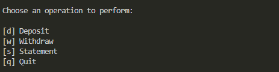

# Simple Banking System Challenge

This challenge was proposed at the Suzano - Python Developer bootcamp, to develop a simple banking system in Python, applying the Python programming knowledge learned in the course to create a functional system that simulates banking operations. The goal is to implement three essential operations: deposit, withdrawal, and statement. 

Final result:
- Options menu:
  
    

- Desposit:
  
    

- Withdraw:
  
    

- Statment:
  
    

